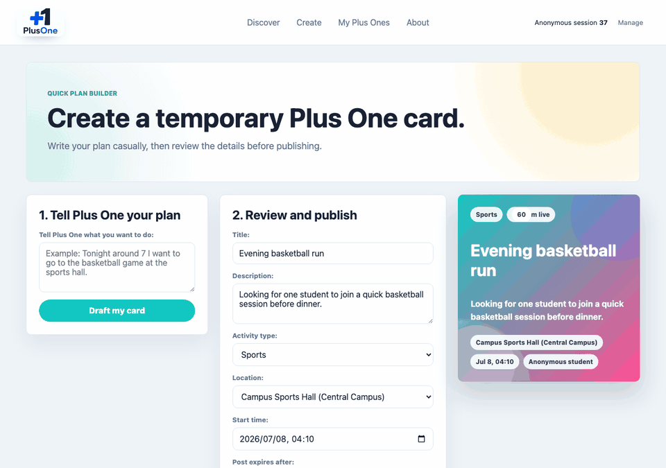
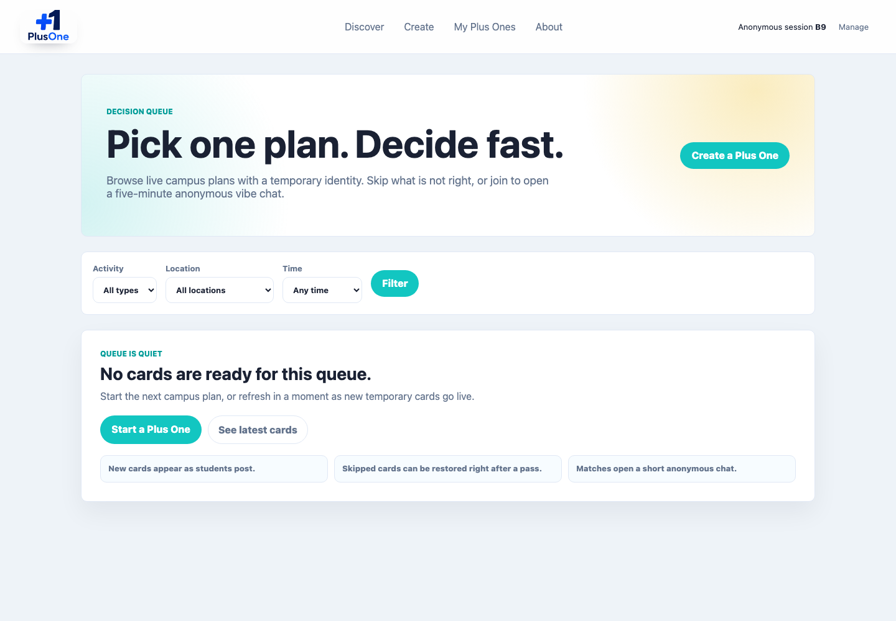
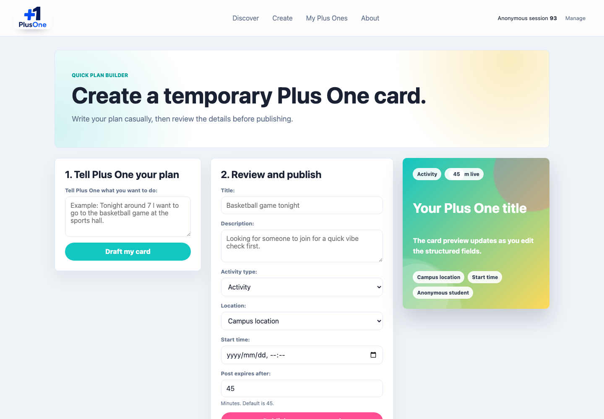
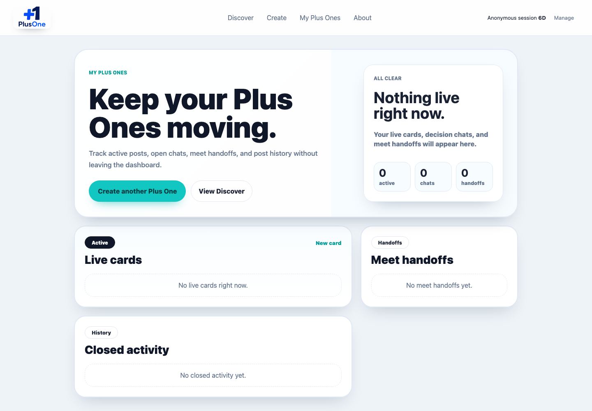
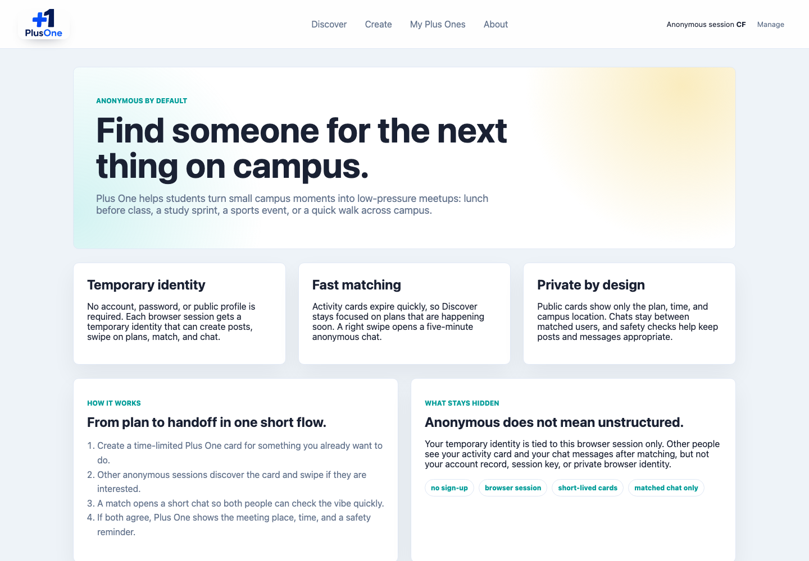

# Plus One

[](https://github.com/luneth8437-cmd/Plus-One/actions/workflows/ci.yml)
[](LICENSE)

Plus One is an AI-assisted anonymous campus activity matcher. Create a temporary card, match with another student, chat briefly, and decide whether to meet.

Live demo: https://plusone-ub3w.onrender.com/

GitHub repo: https://github.com/luneth8437-cmd/Plus-One

If you find the idea useful, a GitHub Star helps other people discover the project.

## Why Plus One

Campus plans often fail because students do not know who is free right now, who wants the same activity, or whether the vibe is safe enough to meet. Plus One turns a casual sentence into a temporary campus card, matches one interested student, opens a short anonymous chat, and only reveals a meet handoff after both people agree.

## Tech Stack

- Django 5
- PostgreSQL
- DeepSeek API through an OpenAI-compatible client
- Render deployment
- WhiteNoise static serving
- Gunicorn + Uvicorn

## Screenshots

### Full Flow Demo



| Discover | Create |
| --- | --- |
|  |  |

| Dashboard | About |
| --- | --- |
|  |  |

## Product Capabilities

- Anonymous session identities with no registration or password.
- Time-limited campus activity cards created from structured fields or casual text.
- Discovery filters, swipe actions, instant matches, and five-minute private chats with lightweight polling.
- Meet handoff after both people agree, with place, time, and a short safety reminder.
- AI-assisted post parsing, icebreakers, and safety moderation with deterministic fallback.
- Dashboard for active, matched, expired, and cancelled plans.

## Product Validation

Plus One includes a validation workspace for turning prototype feedback into product evidence:

- [User interview plan](docs/product_validation/01_user_interviews.md)
- [Mechanism comparison](docs/product_validation/02_mechanism_comparison.md)
- [Usability test report](docs/product_validation/03_usability_test_report.md)
- [Analytics event plan](docs/product_validation/04_analytics_event_plan.md)
- [AI evaluation results template](docs/product_validation/05_ai_evaluation_results.md)
- [Product decision log](docs/product_validation/06_product_decision_log.md)
- [Iteration case studies](docs/product_validation/07_iteration_case_studies.md)

## Main Pages

- `/` and `/discover/` discovery queue with filters, swipe actions, and match modal.
- `/session/` session status, visibility rules, and fresh identity reset.
- `/create/` LLM-assisted post creation with live card preview.
- `/posts/<id>/edit/` owner-only post editing and cancellation.
- `/dashboard/` dashboard for active, matched, expired, and cancelled posts.
- `/chat/<match_id>/` five-minute anonymous chat with near-real-time message refresh and meet handoff.

## Product Flow

```text
Create a temporary card
  -> Review structured details
  -> Publish to Discover
  -> Another anonymous user shows interest
  -> Match opens a short chat
  -> Both users agree
  -> Meet handoff appears with safety reminders
```

## Architecture

```text
Browser
  -> Django templates + static CSS/JS
  -> Django views, services, and selectors
  -> PostgreSQL
  -> DeepSeek API for parsing, icebreakers, and moderation
```

## Setup

```bash
python3 -m venv .venv
.venv/bin/python -m pip install -r requirements.txt
.venv/bin/python manage.py migrate
.venv/bin/python manage.py runserver
```

On Windows PowerShell:

```powershell
py -m venv .venv
.\.venv\Scripts\python.exe -m pip install -r requirements.txt
.\.venv\Scripts\python.exe manage.py migrate
.\.venv\Scripts\python.exe manage.py runserver
```

Open:

```text
http://127.0.0.1:8000/
```

No registration is required. The first visit creates a temporary anonymous session identity and opens Discover. The session remains available in that browser until cookies/session data are cleared or the user starts fresh.

## AI Behavior

If `DEEPSEEK_API_KEY` is set, the app uses DeepSeek through the OpenAI-compatible API for:

- natural-language activity parsing,
- icebreaker generation,
- safety moderation.

Set the key in your shell before running Django:

```bash
export DEEPSEEK_API_KEY="your_deepseek_api_key"
export DEEPSEEK_BASE_URL="https://api.deepseek.com"
export PLUSONE_LLM_MODEL="deepseek-v4-flash"
```

Do not commit API keys. If you prefer a local `.env` file, keep it untracked and load it before starting Django:

```bash
set -a
source .env
set +a
```

If `DEEPSEEK_API_KEY` is not set but `OPENAI_API_KEY` is set, the app uses OpenAI. If no API key is set, the app automatically uses deterministic rule-based fallback. All AI and fallback calls are stored in `LLMLog`.

Run the baseline evaluation:

```bash
.venv/bin/python manage.py evaluate_ai
```

## Hosted Deployment

To run one hosted instance that keeps `DEEPSEEK_API_KEY` on the server and lets other people use the app through a public URL, follow [DEPLOY_RENDER.md](DEPLOY_RENDER.md).

## Repository Docs

- [Deployment guide](DEPLOY_RENDER.md)
- [Contributing guide](CONTRIBUTING.md)
- [Security policy](SECURITY.md)
- [MIT license](LICENSE)
- [Product validation workspace](docs/product_validation/README.md)

## Safety and Privacy

- No account signup is required for the core flow.
- Anonymous browser sessions isolate each temporary identity.
- Unsafe post drafts and chat messages are moderated before they are accepted.
- The DeepSeek API key stays on the server through environment variables.
- Production deployment does not seed demo users or demo posts.

## Roadmap

- Add real campus authentication or verified student email mode.
- Add richer reporting and moderation review tools.
- Add notification support for pending chats.
- Add mobile-first polish for repeated daily use.
- Add analytics for funnel health without exposing private chat content.

## Core Flow

1. Open the site root and land in Discover with a generated anonymous session.
2. Create a post from casual text.
3. Review the AI-generated structured card and live preview.
4. Publish.
5. Use another browser session, or choose **Start fresh identity** on Session, to act as a separate temporary identity.
6. Swipe interested.
7. Confirm the match modal.
8. Enter the five-minute anonymous chat.
9. Send a message and agree to meet.
10. When both people agree, review the meet handoff and safety reminder.
11. View My Plus Ones dashboard.

## Tests

```bash
.venv/bin/python manage.py test
```

Current test coverage includes anonymous session identity creation, post creation, identity reset, unsafe post blocking, editing/cancelling posts, discovery filtering rules, swipe/match behavior, chat permissions, chat expiry, moderation logging, and dashboard status separation.
